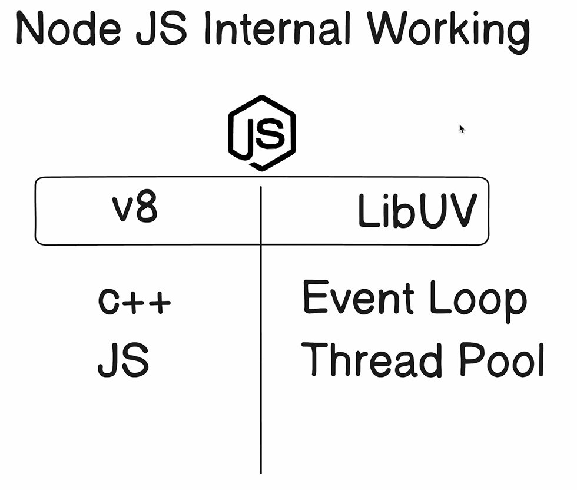
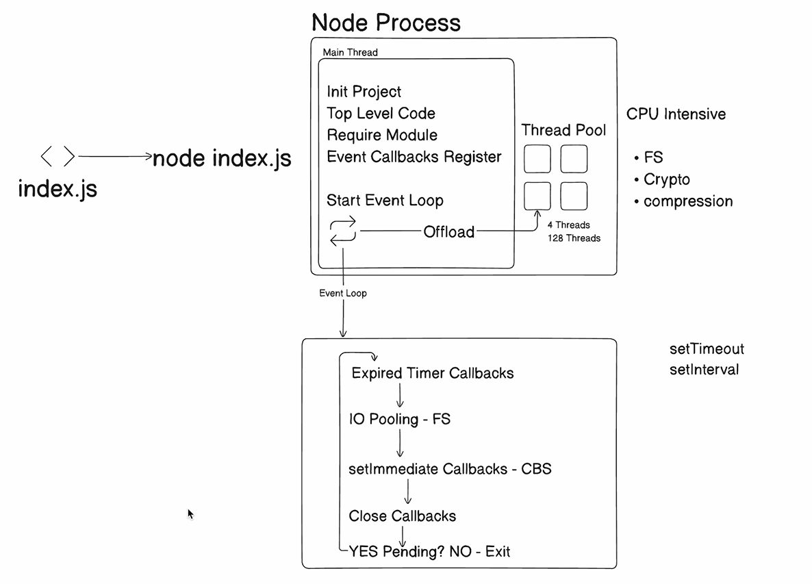

# [How Node JS Work](https://youtu.be/_eJ6KAb56Gw?si=BRXOPUoWzgSuQDgt)

## Main Node Components
v8 engine(c++ and JS , excutre js code) and LibUV(Event Loop and Thread Poolf) make Node

## How node excutre code
Node create one process which work on singal thread (mian thread) 

