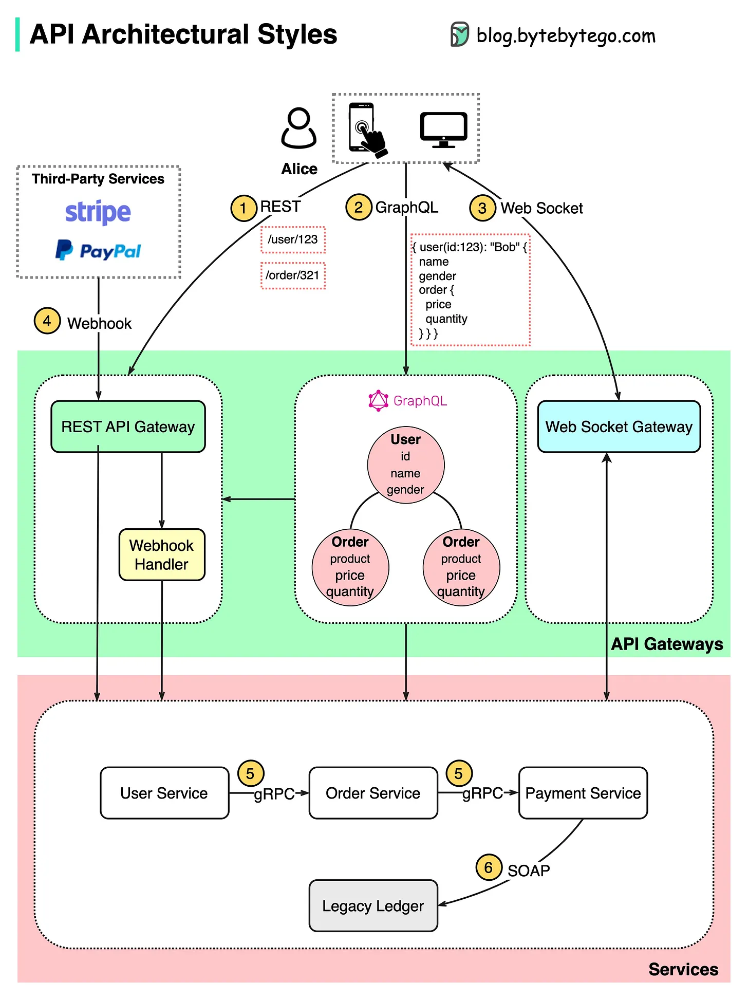

# Types of API
Let’s break down the types of APIs, including SOAP, REST, GraphQL, gRPC, Webhook, and WebSocket, with simple language and real-world use cases for better understanding:

### 1. **SOAP (Simple Object Access Protocol)**
   - **What it is**: SOAP is a protocol for exchanging structured information in the form of XML. It was designed for high-level security and reliability.
   - **How it works**: SOAP uses XML to send messages and relies on specific protocols like HTTP or SMTP for communication.
   - **Key features**:
     - High security (used in banking systems).
     - Strong error handling.
     - Built-in standards (for security, addressing, etc.).
   - **Real-world use case**: **Banking systems** where secure communication and transactions are essential (e.g., transferring money between banks securely).

### 2. **REST (Representational State Transfer)**
   - **What it is**: REST is an architectural style for APIs that use HTTP requests to perform operations (GET, POST, PUT, DELETE).
   - **How it works**: REST sends and receives data as JSON, XML, or other formats, but JSON is most common.
   - **Key features**:
     - Lightweight and fast.
     - Stateless (no session is maintained between requests).
     - Can work with different types of data (like JSON).
   - **Real-world use case**: **Social media apps** (e.g., when you post a tweet, the app makes a POST request, and when you read tweets, it makes a GET request).

### 3. **GraphQL**
   - **What it is**: GraphQL is a query language for APIs that allows clients to request exactly the data they need, making it more efficient than REST.
   - **How it works**: Clients define the structure of the response, which reduces the number of requests (unlike REST where multiple endpoints might be needed).
   - **Key features**:
     - Allows clients to ask for specific fields (no over-fetching or under-fetching data).
     - Single endpoint for all operations.
     - Efficient for complex queries.
   - **Real-world use case**: **GitHub API** uses GraphQL. Developers can query only the specific details of repositories they need, like name, description, or stars count.
  
### 4. **gRPC (gRPC Remote Procedure Call)**
   - **What it is**: gRPC is an open-source RPC framework that allows services to directly communicate with each other in different languages (e.g., Python calling a service written in Go).
   - **How it works**: It uses protocol buffers (protobufs) for defining services and methods, and sends binary data, making it super fast.
   - **Key features**:
     - High performance (better than JSON-based REST).
     - Supports bi-directional streaming.
     - Strong typing (thanks to protobufs).
   - **Real-world use case**: **Microservices in large applications** (e.g., Google uses gRPC internally for its services where speed is crucial).
   - [Video Link](https://youtu.be/PSe4GuLOFZw?si=GCVlGUFHl7pym54q)

### 5. **Webhook**
   - **What it is**: A webhook is an API concept where a server automatically sends data to another server when a certain event happens.
   - **How it works**: When an event occurs (e.g., a payment is made), the originating server sends an HTTP POST request to a predefined URL to notify the other system.
   - **Key features**:
     - Event-driven (data is sent when something happens).
     - Efficient for notifications (instead of constantly checking).
   - **Real-world use case**: **Payment processing** (e.g., Stripe uses webhooks to notify your system when a payment succeeds).

### 6. **WebSocket**
   - **What it is**: WebSocket is a communication protocol that provides full-duplex communication, meaning both client and server can send data to each other simultaneously.
   - **How it works**: Once a WebSocket connection is established, messages can be sent and received in real time without reopening the connection (unlike HTTP which needs to open/close with each request).
   - **Key features**:
     - Real-time, two-way communication.
     - Persistent connection between client and server.
   - **Real-world use case**: **Online chat applications** (e.g., Facebook Messenger or Slack where messages are sent and received in real time without refreshing the page).

### Summary Table:

| API Type  | How It Works         | Best Use Cases                   | Key Features                  |
|-----------|----------------------|----------------------------------|-------------------------------|
| SOAP      | XML over HTTP/SMTP    | Banking, financial systems       | High security, reliability     |
| REST      | HTTP requests (JSON)  | Social media, web services       | Lightweight, stateless         |
| GraphQL   | Query language over HTTP | Complex apps (e.g., GitHub API)  | Efficient data fetching        |
| gRPC      | Protocol buffers, binary data | Microservices, high performance apps | Fast, bi-directional streaming |
| Webhook   | Event-driven HTTP POST | Payment systems, notifications   | Sends data on event triggers   |
| WebSocket | Persistent connection  | Real-time apps (e.g., chat)      | Real-time, two-way communication|

Each of these APIs has its own strengths depending on the use case, so selecting the right one depends on the specific requirements of the system you're building.

---
 ### Resources

[Top 6 Most Popular API Architecture Styles](https://youtu.be/4vLxWqE94l4?si=HjtR3fi-f4mMTst6)

[Why you should NOT use GraphQL as a backend developer?](https://youtu.be/ixDrzlinMx0?si=SBm3D3o8lCMmKJGA)

[tRPC, gRPC, GraphQL or REST: when to use what?](https://youtu.be/veAb1fSp1Lk?si=YBEDoWwIdSbVI9Ix)

[Images](https://app.napkin.ai/page/CgoiCHByb2Qtb25lEiwKBFBhZ2UaJGMxYzk2ZjE0LWFkZGItNGJhOS04NWM0LWQ5NDA1M2FiYmNkNQ?s=1)